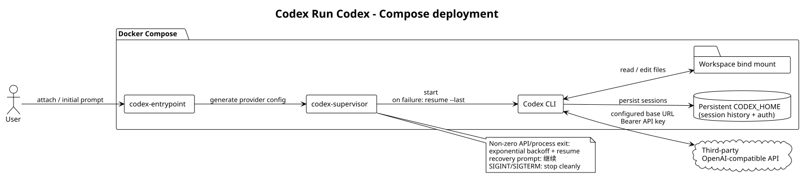

# Codex Run Codex

一个用 Docker Compose 运行 Codex CLI 的轻量监督器。它支持 OpenAI 兼容的第三方 API；如果 Codex 因临时 API 或进程错误退出，会等待后自动执行 `resume --last "继续"`，让持久化会话继续工作。



## 特性

- 第三方 provider 通过环境变量配置，启动时生成隔离的 `config.toml`；
- API key 支持环境变量或宿主机文件，认证文件只写入 Compose 持久卷；
- 非零退出自动指数退避并恢复最近会话，默认无限重试；
- 正常退出、Ctrl-C 和 SIGTERM 不会被误判为 API 故障；
- 工作区以 bind mount 提供，`CODEX_HOME` 以 named volume 持久化；
- 容器以非 root 用户运行，并启用只读根文件系统和能力裁剪。

## 快速开始

```bash
cp .env.example .env
# 编辑 .env：CODEX_PROVIDER_BASE_URL、CODEX_MODEL、CODEX_API_KEY
./scripts/docker-build.sh codex-run-codex:local .
docker compose up -d
docker compose attach codex
```

如果不想把 key 放进 `.env`，例如：

```dotenv
CODEX_API_KEY_FILE=/absolute/path/to/codex-api-key
CODEX_API_KEY=
```

第三方接口需要兼容 Codex 支持的 `responses` 或 `chat` wire API。`CODEX_PROVIDER_BASE_URL` 应填写接口要求的 base URL，例如是否包含 `/v1` 由供应商定义。

默认情况下，`CODEX_MAX_RETRIES=0` 表示无限恢复；每次等待时间按指数增长，最大为 60 秒。若退出码是 130 或 143，监督器认为是人工中断并停止。需要开始新会话时，设置 `CODEX_RESET_SESSION=1`，或者按[Compose 部署说明](docs/deployment/docker-compose.md)运行一次性容器。

## 文档

- [架构说明](docs/architecture/overview.md)
- [Docker Compose 部署](docs/deployment/docker-compose.md)
- [监督器测试](docs/testing/supervisor.md)
- [PlantUML 架构源文件](docs/diagrams/codex-run-codex.puml)
