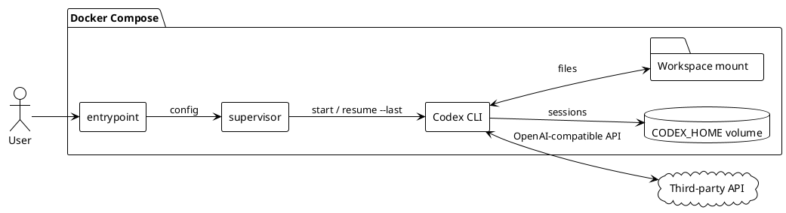

# 运行架构

本项目只有一个运行服务：Compose 中的 `codex` 容器。入口脚本负责生成第三方 provider 配置，监督器负责启动 Codex CLI，并在非正常退出后恢复最近持久化会话。

```plantuml
@startuml
!theme plain
left to right direction
skinparam componentStyle rectangle
skinparam shadowing false

actor "User" as user
package "Docker Compose" {
  component "entrypoint" as entry
  component "supervisor" as supervisor
  component "Codex CLI" as codex
  database "CODEX_HOME volume" as home
  folder "Workspace mount" as workspace
}
cloud "Third-party API" as api

user --> entry
entry --> supervisor : config
supervisor --> codex : start / resume --last
codex <--> api : OpenAI-compatible API
codex --> home : sessions
codex <--> workspace : files
@enduml
```

可直接查看完整源文件和渲染图：[`codex-run-codex.puml`](../diagrams/codex-run-codex.puml)。
