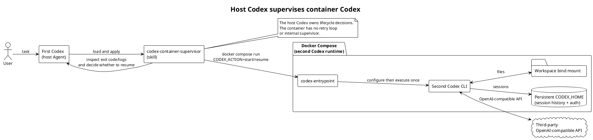

# 运行架构

本项目将两个 Codex 的职责分开：第一个 Codex 是运行在宿主机上的 Agent，加载 `codex-container-supervisor` skill；第二个 Codex CLI 才运行在 Compose 容器内。容器入口只负责生成第三方 provider/auth 配置并执行一次 CLI 调用，退出状态和日志交由宿主机的第一个 Codex 判断，必要时再显式启动 `resume --last`。

容器内没有自动重试、会话状态文件或第二层 shell supervisor。这样重启、恢复和停止决策只有一个所有者：宿主机的第一个 Codex。

可直接查看完整源文件和渲染图：[`codex-run-codex.puml`](../diagrams/codex-run-codex.puml)。
